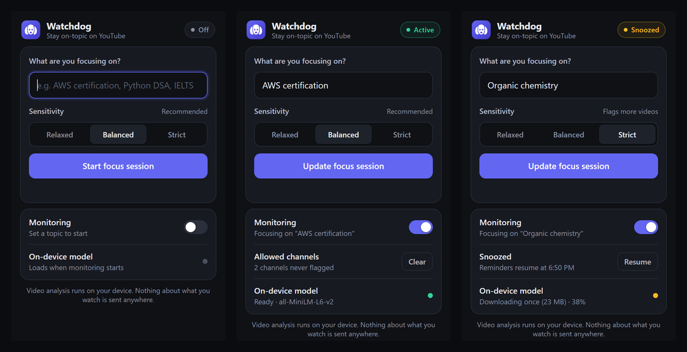
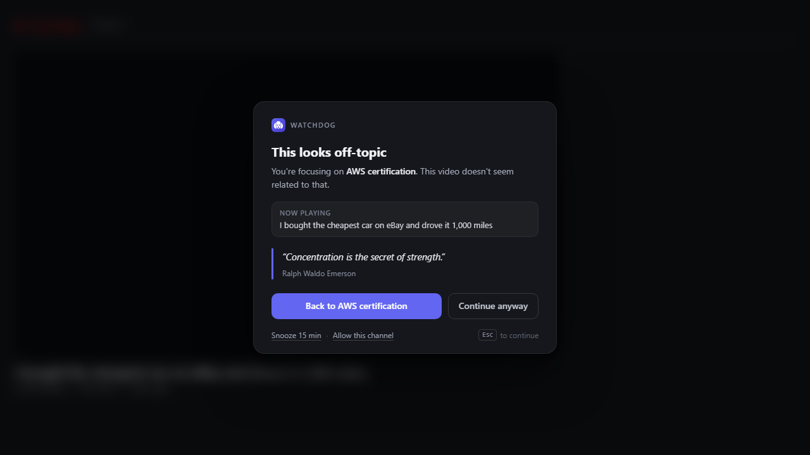

# Watchdog


A Chrome extension that notices when the YouTube video you're watching has drifted away from
what you sat down to study, and shows a calm reminder instead of letting you disappear down
the recommendation hole.

Relevance is judged **on your device** by a small language model. No API key, no server, and
nothing about what you watch ever leaves your machine.



## How it works

1. Set a focus topic in the popup, for example `AWS certification`.
2. On every YouTube watch page, Watchdog reads the video title and channel name.
3. A local model scores how related they are to your topic.
4. If it's off-topic, the video pauses and a card appears.



The card gives you four ways out: go back to your topic, continue anyway, snooze for 15
minutes, or permanently allow that channel. `Esc` dismisses it.

**It fails open.** If the model can't load or a check errors, the video plays normally.
Watchdog never blocks you.

## Install

```bash
npm install
npm run build
```

Then in Chrome:

1. Open `chrome://extensions`
2. Turn on **Developer mode**, top right
3. Click **Load unpacked** and select the `dist/` folder

On first use the model downloads once (23 MB) and is cached by the browser. The popup shows
progress. After that, checks take about 250 ms.

## Features

| | |
| --- | --- |
| **On-device scoring** | `all-MiniLM-L6-v2` runs in the extension's service worker |
| **Three sensitivity levels** | Relaxed, Balanced, Strict |
| **Shorts handling** | Flagged on sight by default, since their titles carry no signal |
| **Channel allow list** | Mark a channel as always fine |
| **Snooze** | 15 minutes of quiet |
| **100 bundled quotes** | Curated for focus and success, shown at random |

## How relevance is decided

A video is left alone when **any one** of three signals says it belongs. Each can only rescue
a video, never condemn one, so mistakes tend to be missed distractions rather than
interruptions to real work.

**Title similarity.** The primary signal. The topic is embedded as `studying <topic>` rather
than as a bare noun, which puts it in the same register as a video title. That change alone
cut false alarms from 7/15 to 1/15.

**Channel similarity, against a much higher bar.** A lecture called *Week 4 - Part 2* tells
the model nothing, but the channel *AWS Training and Certification* scores 0.89. Channel
names are noisy, so they must clear 0.35 rather than the title threshold.

**Literal word overlap.** Embeddings are weak on acronyms. *LeetCode 101: Two Sum explained*
scores 0.057 against `studying Python DSA`, below most unrelated videos. When half the
topic's words appear literally in the title or channel, the video is treated as relevant.

**Shorts are judged on format, not content.** A Short's title is routinely just a hashtag, so
there's nothing to score. Every Short triggers a reminder by default, which also means no
waiting for the model. Turn off **Flag all Shorts** in the popup to score them normally.

Thresholds come from measurement. See [docs/calibration.md](docs/calibration.md).

| Sensitivity | Threshold | False alarms | Misses |
| --- | --- | --- | --- |
| Relaxed | 0.12 | 1/20 | 3/22 |
| Balanced (default) | 0.15 | 1/20 | 1/22 |
| Strict | 0.24 | 3/20 | 0/22 |

## Privacy

Video titles and channel names are read in the page, scored locally, and discarded. They are
never transmitted. Your focus topic lives in `chrome.storage.local` and stays on the machine.

Watchdog makes **one** kind of network request: downloading the model from Hugging Face on
first use, once. Quotes are bundled, so reminders work fully offline.

Permissions are `storage` plus host access to YouTube. Nothing else. No analytics, no
telemetry, no remote logging.

## Development

| Command | What it does |
| --- | --- |
| `npm run build` | Build into `dist/` |
| `npm run watch` | Rebuild on change |
| `npm test` | Unit tests |
| `npm run typecheck` | Type-check without emitting |
| `npm run icons` | Re-render PNG icons from the SVG logo |
| `npm run calibrate` | Score labelled cases with the real model |
| `npm run sweep` | Re-derive thresholds from scratch |
| `npm run e2e` | Load the extension in Chrome and watch it fire |
| `npm run e2e:shorts` | The same, against a real Short |

The end-to-end tests need Chrome for Testing, because Chrome 137+ refuses `--load-extension`:

```bash
npx @puppeteer/browsers install chrome@stable --path .browser
```

### Layout

```text
src/
  background.ts       Service worker: owns the model, answers relevance checks
  content.ts          YouTube watcher: detects navigation, decides when to prompt
  overlay.ts          The reminder card (closed shadow root, textContent only)
  popup.ts            Popup UI
  lib/
    similarity.ts     Model loading, embedding, scoring
    lexical.ts        Literal word-overlap safety net
    quotes.ts         Bundled quotes, random without immediate repeats
    settings.ts       Stored settings, thresholds, snooze
    sanitize.ts       Input cleaning for every untrusted string
data/quotes.json      100 curated quotes
```

### Adding quotes

Add to `data/quotes.json` and run `npm test`. The suite checks the count, rejects duplicates
and unattributed entries, and enforces length and tone.

## Security

- CSP is `script-src 'self' 'wasm-unsafe-eval'`. The WebAssembly grant is required by the
  model runtime; no remote script can load, and there is no `eval` in the bundle.
- The reminder card lives in a **closed** shadow root, so YouTube can neither read nor
  restyle it.
- Every string reaching the DOM is sanitized and set with `textContent`. `innerHTML` is never
  used with variable data.
- The service worker ignores messages from other extensions and only accepts checks from a
  content script on `https://www.youtube.com/`.

## Tech

Manifest V3 · TypeScript · esbuild · `@huggingface/transformers` with ONNX Runtime Web

## Credits

Built with [Claude](https://claude.com/claude-code) as a coding assistant.

## Licence

[GNU General Public License v3.0](LICENSE)
